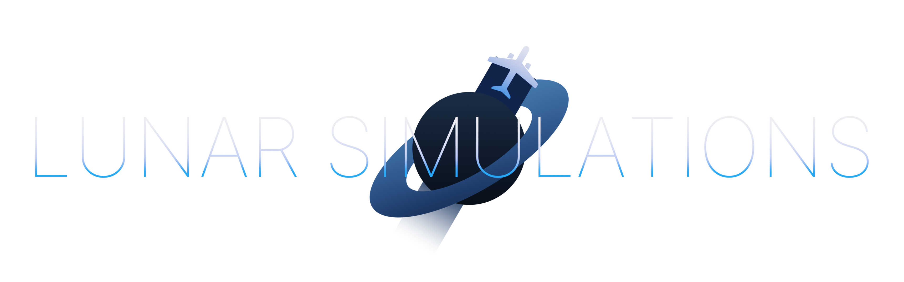

# Website
Lunar Simulations website repo.

## Built with
...vanilla HTML, CSS and JS
No dependencies.

## Contributing
1. Fork the Project
2. Make your changes
3. Commit your changes
4. Push to the new fork
5. Open a Pull Request